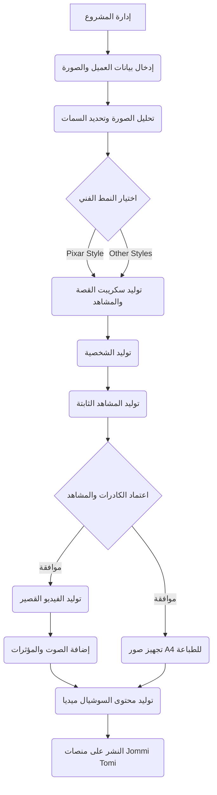

# الوثيقة التقنية الشاملة لنظام تومي جومي (Jommi Tomi Command & Control System)

**إصدار:** 1.0

**تاريخ:** 6 مايو 2026

**المؤلف:** Manus AI

---

## 1. المقدمة

يهدف هذا المستند إلى تقديم نظرة تقنية شاملة لنظام "تومي جومي" (Jommi Tomi)، وهو نظام آلي متكامل مصمم لتحويل صور الأطفال إلى قصص مصورة فريدة بأسلوب Pixar. يغطي المستند جميع جوانب النظام، بدءًا من الأهداف والرؤية، مرورًا بالهيكلية الشجرية (Node-based Architecture) وسير العمل، وصولًا إلى مكتبة البرومبات (Prompt Library) الاحترافية التي تشكل جوهر العملية الإبداعية. يركز النظام على أتمتة رحلة العميل بالكامل، بدءًا من تحميل الصورة وحتى تسليم المنتجات النهائية، مع التركيز على سهولة الاستخدام، الكفاءة الإنتاجية، والجودة الفنية العالية.

## 2. الأهداف الرئيسية للنظام

يسعى نظام "تومي جومي" إلى تحقيق أتمتة شاملة تغطي جميع مراحل الإنتاج من الإدخال إلى الإخراج النهائي. من أهم أهدافه ضمان **ثبات الشخصية** واتساق ملامح الطفل في جميع المشاهد والأنماط الفنية. كما يوفر النظام **مرونة في الأنماط الفنية**، مع دعم أنماط متعددة والتركيز بشكل خاص على أسلوب Pixar. بالإضافة إلى ذلك، يهدف النظام إلى إنتاج **مخرجات متنوعة** تشمل كتبًا مطبوعة بحجم A4، فيديوهات متحركة، ومحتوى مخصص لوسائل التواصل الاجتماعي. كل ذلك يتم من خلال **تجربة مستخدم سلسة** تحاكي أنظمة التشغيل الحديثة، مع الاعتماد الأقصى على الأدوات المجانية والمتاحة لتقليل التكاليف التشغيلية.

## 3. الهيكلية الشجرية والمكونات الأساسية (Nodes)

سيتم تقسيم النظام إلى مجموعة من العقد (Nodes) المترابطة، حيث تمثل كل عقدة مرحلة أو وظيفة محددة في سير العمل. يمكن تصور هذه العقد كشجرة، حيث يمثل كل فرع مسارًا محتملاً أو عملية فرعية. يوضح الجدول التالي المكونات الأساسية للنظام ووظائفها.

| اسم العقدة | الوظيفة الرئيسية | المدخلات | المخرجات |
| :--- | :--- | :--- | :--- |
| **إدارة المشروع** | نقطة البداية والإدارة المركزية لجميع المشاريع. | بيانات المشروع الأولية. | توجيه المشروع عبر العقد الفرعية. |
| **إدخال بيانات العميل والصورة** | جمع المعلومات الأولية من العميل. | صورة الطفل، العمر، الاسم، تفضيلات القصة. | ملف بيانات العميل، الصورة الأصلية. |
| **تحليل الصورة وتحديد السمات** | استخلاص السمات الأساسية للحفاظ على ثبات الشخصية. | الصورة الأصلية، العمر. | ملف سمات الوجه والجسم، نقاط مرجعية. |
| **اختيار النمط الفني** | تحديد النمط الفني للقصة (Pixar أو غيره). | تفضيلات العميل. | النمط الفني المختار. |
| **توليد سكريبت القصة والمشاهد** | توليد سكريبت القصة وتفاصيل المشاهد. | بيانات العميل، النمط المختار، مكتبة البرومبات. | سكريبت القصة المفصل، وصف المشاهد. |
| **توليد الشخصية** | تحويل صورة الطفل إلى شخصية بأسلوب Pixar. | الصورة الأصلية، سمات الوجه، النمط، البرومبتات. | Character Sheet، Model Sheet. |
| **توليد المشاهد الثابتة** | توليد المشاهد الثابتة للقصة. | Character Sheet، وصف المشاهد، النمط، البرومبتات. | صور المشاهد الثابتة (16:9 و A4). |
| **اعتماد الكادرات والمشاهد** | مراجعة واعتماد المشاهد الثابتة من قبل العميل. | صور المشاهد الثابتة. | تأكيد اعتماد المشاهد. |
| **توليد الفيديو القصير** | تحويل المشاهد المعتمدة إلى فيديو قصير. | صور المشاهد (16:9)، سكريبت القصة، البرومبتات. | ملف الفيديو الخام. |
| **إضافة الصوت والمؤثرات** | إضافة العناصر الصوتية للفيديو. | ملف الفيديو الخام، سكريبت القصة، تفضيلات الصوت. | ملف الفيديو النهائي مع الصوت. |
| **توليد محتوى السوشيال ميديا** | إنشاء محتوى ترويجي من مخرجات القصة. | صور المشاهد، ملف الفيديو النهائي، ملخص القصة. | مقاطع ريلز، أغلفة للقصة، منشورات ترويجية. |
| **النشر على منصات Jommi Tomi** | نشر المحتوى النهائي على المنصات المحددة. | ملف الفيديو النهائي، صور الطباعة، محتوى السوشيال ميديا. | نشر المحتوى. |

## 4. سير العمل الشجري (Tree-like Workflow)

يمكن تمثيل سير العمل كشجرة تبدأ من العقدة الرئيسية وتتفرع إلى العقد الفرعية. كل عقدة تنفذ مهمة محددة وتمرر مخرجاتها إلى العقدة التالية. يمكن أن يكون هناك تفرعات اختيارية (مثل اختيار النمط الفني) أو تفرعات متوازية (مثل توليد صور الطباعة والفيديو في نفس الوقت بعد اعتماد الشخصية).

## 5. الأدوات والتقنيات المقترحة

يعتمد النظام على مجموعة من الأدوات والتقنيات المتقدمة لضمان جودة المخرجات. يتم استخدام **Magnific.ai** بشكل أساسي لتحويل الصور والحفاظ على ثبات الشخصية وتوليد المشاهد. كبديل مجاني أو مكمل، يمكن استخدام **Stable Diffusion** مع **ControlNet** لتحقيق نفس الأهداف. لتوليد الفيديو، يُقترح استخدام أدوات مثل **RunwayML** أو **Pika Labs**، مع البحث المستمر عن بدائل مجانية فعالة. أما بالنسبة للصوت، فيمكن الاعتماد على **ElevenLabs** لتوليد التعليق الصوتي، واستخدام **Audacity** لتحرير الصوت وإضافة المؤثرات. يتم ربط هذه الأدوات وأتمتة سير العمل باستخدام لغات برمجة مثل **Python**، بينما يمكن استخدام **Node.js** لتطوير الواجهة الأمامية للنظام إذا لزم الأمر.

## 6. مكتبة البرومبات الاحترافية (Prompt Library)

تعتبر هندسة الأوامر (Prompt Engineering) حجر الزاوية في نظام "تومي جومي" لضمان جودة المخرجات واتساقها. توفر هذه المكتبة مجموعة شاملة من البرومبات المصممة خصيصًا لكل مرحلة من مراحل الإنتاج. تم تصميم هذه البرومبات لتكون قابلة للتخصيص (عبر المتغيرات بين الأقواس `[ ]`) لتناسب كل طفل وقصة.

### 6.1. برومبتات توليد الشخصية (Character Generation Prompts)

> **البرومبت الأساسي (Base Image to Pixar Style):**
> "A highly detailed, 3D rendered portrait of a [Age]-year-old [Gender] child in the style of a modern Pixar or Disney animation. The child has [Hair Color and Style], [Eye Color] eyes, and a [Facial Expression/Feature, e.g., cheerful smile, freckles]. They are wearing [Clothing Description]. The lighting is soft, cinematic, and magical, with vibrant colors and exaggerated, expressive, yet charming facial features. High quality, 8k resolution, masterpiece, octane render, unreal engine 5."

> **برومبت ورقة الشخصية (Character Sheet / Model Sheet):**
> "A comprehensive 3D character design model sheet of a [Age]-year-old [Gender] child in Pixar animation style. The sheet includes multiple angles: front view, side profile, three-quarter view, and back view. The character has [Hair Color and Style], [Eye Color] eyes, and is wearing [Clothing Description]. The background is a neutral, solid light gray color. The character's expressions are neutral but expressive. High resolution, clean lines, professional character design turnaround, 8k, highly detailed."

### 6.2. برومبتات توليد المشاهد الثابتة (Still Scene Generation Prompts)

> **برومبت مشهد عام (General Story Scene):**
> "A cinematic, wide-angle shot in Pixar 3D animation style. The main character, a [Age]-year-old [Gender] child with [Hair Color] and [Clothing Description], is [Action/Pose, e.g., discovering a glowing magical book] in a [Setting/Environment, e.g., cozy, dimly lit ancient library]. The lighting is dramatic and magical, with glowing particles and soft shadows. Vibrant colors, highly detailed environment, emotional storytelling, 8k resolution, masterpiece. Aspect ratio: [16:9 for video / 3:4 or A4 ratio for print]."

> **برومبت لقطة قريبة (Close-up / Emotional Shot):**
> "A close-up portrait shot in Pixar 3D animation style. The main character, a [Age]-year-old [Gender] child with [Hair Color], is showing a [Emotion, e.g., look of pure wonder and amazement]. The background is beautifully blurred (bokeh effect) showing hints of a [Setting, e.g., magical forest]. Soft, warm rim lighting on the character's hair, highly expressive eyes, detailed textures, cinematic lighting, 8k resolution."

### 6.3. برومبتات توليد الفيديو (Video Generation Prompts)

> **برومبت تحريك مشهد هادئ (Subtle Motion):**
> "Subtle, cinematic motion. The child's hair blows gently in the wind, and they blink naturally. The camera slowly pans forward (dolly in). The magical glowing elements in the background twinkle softly. High quality, smooth animation, consistent character."

> **برومبت تحريك مشهد نشط (Active Motion):**
> "Dynamic motion. The child [Action, e.g., reaches out to touch the glowing butterfly]. The camera follows the movement smoothly. The environment reacts to the movement, with [Environmental Effect, e.g., leaves rustling]. Cinematic lighting, high frame rate, smooth transition."

### 6.4. برومبتات توليد محتوى السوشيال ميديا (Social Media Content Prompts)

> **برومبت غلاف القصة (Book Cover):**
> "A magical and captivating children's book cover in Pixar 3D animation style. The main character, a [Age]-year-old [Gender] child, is standing in the center, looking up at a [Magical Element, e.g., giant glowing tree]. The title area at the top is left blank with negative space for text. Vibrant, eye-catching colors, bold composition, magical atmosphere, highly detailed, 8k resolution. Aspect ratio: 3:4."

> **برومبت منشور ترويجي (Promotional Post - e.g., Instagram):**
> "A vibrant, engaging promotional image in Pixar 3D style. The main character is holding a glowing, magical storybook that is emitting soft light onto their face. They are looking directly at the camera with an inviting smile. The background is a colorful, abstract magical realm. High contrast, saturated colors, perfect for social media, 8k resolution. Aspect ratio: 1:1 or 4:5."

### 6.5. إرشادات عامة لاستخدام البرومبات

*   **التخصيص:** يجب استبدال جميع المتغيرات بين الأقواس `[ ]` بالبيانات الفعلية للطفل والقصة قبل استخدام البرومبت.
*   **الوزن (Weighting):** في بعض الأدوات (مثل Midjourney)، يمكن استخدام الأوزان (مثل `::2`) للتركيز على عناصر معينة في البرومبت (مثل `Pixar style::2`).
*   **البرومبت السلبي (Negative Prompt):** يُنصح دائمًا باستخدام برومبت سلبي لتجنب التشوهات، مثل: "ugly, deformed, poorly drawn, realistic, photographic, anime, 2d, text, watermark, extra limbs, bad anatomy".
*   **التجربة والتحسين:** قد تتطلب البرومبات بعض التعديلات الطفيفة بناءً على الأداة المستخدمة والصورة الأصلية للطفل للحصول على أفضل النتائج.

## 7. الخلاصة

يمثل هذا التصميم الشامل للهيكلية الشجرية ومكتبة البرومبات خارطة طريق متكاملة لتطوير وتشغيل نظام "تومي جومي". من خلال دمج هذه المكونات، يمكن بناء نظام قوي، مرن، وفعال يلبي طموحات المشروع، ويقدم تجربة ساحرة للعملاء، ويحول صور أطفالهم إلى ذكريات فنية لا تُنسى.

## 8. المراجع

[1] Magnific AI. (2026). *Custom Characters*. Retrieved from https://www.magnific.com/ai/custom-characters

[2] PromptBase. (2026). *Disney Pixar Style Character Sheet Generator App*. Retrieved from https://promptbase.com/app/disney-pixar-style-character-sheet

[3] OpenArt. (2026). *The Best 25 Midjourney Prompts for Pixar*. Retrieved from https://openart.ai/blog/post/midjourney-prompts-for-pixar

[4] LTX Studio. (2026). *AI Video Prompt Guide: How To Write AI Video Prompts*. Retrieved from https://ltx.studio/blog/ai-video-prompt-guide
