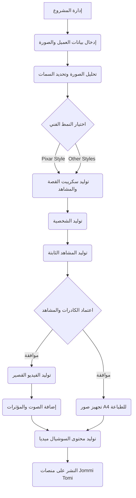

# تصميم الهيكلية الشجرية لنظام تومي جومي (Jommi Tomi Command & Control System)

## 1. المقدمة
يهدف هذا المستند إلى تفصيل الهيكلية الشجرية (Node-based Architecture) لنظام "تومي جومي"، وهو نظام آلي متكامل لتحويل صور الأطفال إلى قصص مصورة بأسلوب Pixar، مع مخرجات متعددة تشمل كتبًا مطبوعة بحجم A4، وفيديوهات متحركة، ومحتوى مخصص لوسائل التواصل الاجتماعي. يركز النظام على أتمتة رحلة العميل بالكامل، بدءًا من تحميل الصورة وحتى تسليم المنتجات النهائية، مع التركيز على سهولة الاستخدام والكفاءة الإنتاجية.

## 2. الأهداف الرئيسية للنظام
يسعى نظام "تومي جومي" إلى تحقيق أتمتة شاملة تغطي جميع مراحل الإنتاج من الإدخال إلى الإخراج النهائي. من أهم أهدافه ضمان ثبات الشخصية واتساق شخصية الطفل في جميع المشاهد والأنماط الفنية. كما يوفر النظام مرونة في الأنماط الفنية، مع دعم أنماط متعددة والتركيز بشكل خاص على أسلوب Pixar. بالإضافة إلى ذلك، يهدف النظام إلى إنتاج مخرجات متنوعة تشمل كتبًا مطبوعة، فيديوهات متحركة، ومحتوى مخصص لوسائل التواصل الاجتماعي. كل ذلك يتم من خلال واجهة مستخدم سلسة تحاكي أنظمة التشغيل الحديثة، مع الاعتماد الأقصى على الأدوات المجانية لتقليل التكاليف.

## 3. المكونات الأساسية للنظام (Nodes)
سيتم تقسيم النظام إلى مجموعة من العقد (Nodes) المترابطة، حيث تمثل كل عقدة مرحلة أو وظيفة محددة في سير العمل. يمكن تصور هذه العقد كشجرة، حيث يمثل كل فرع مسارًا محتملاً أو عملية فرعية.

| اسم العقدة | الوظيفة الرئيسية | المدخلات | المخرجات |
| :--- | :--- | :--- | :--- |
| **إدارة المشروع** | نقطة البداية والإدارة المركزية لجميع المشاريع. | بيانات المشروع الأولية. | توجيه المشروع عبر العقد الفرعية. |
| **إدخال بيانات العميل والصورة** | جمع المعلومات الأولية من العميل. | صورة الطفل، العمر، الاسم، تفضيلات القصة. | ملف بيانات العميل، الصورة الأصلية. |
| **تحليل الصورة وتحديد السمات** | استخلاص السمات الأساسية للحفاظ على ثبات الشخصية. | الصورة الأصلية، العمر. | ملف سمات الوجه والجسم، نقاط مرجعية. |
| **اختيار النمط الفني** | تحديد النمط الفني للقصة (Pixar أو غيره). | تفضيلات العميل. | النمط الفني المختار. |
| **توليد سكريبت القصة والمشاهد** | توليد سكريبت القصة وتفاصيل المشاهد. | بيانات العميل، النمط المختار، مكتبة البرومبات. | سكريبت القصة المفصل، وصف المشاهد. |
| **توليد الشخصية** | تحويل صورة الطفل إلى شخصية بأسلوب Pixar. | الصورة الأصلية، سمات الوجه، النمط، البرومبتات. | Character Sheet، Model Sheet. |
| **توليد المشاهد الثابتة** | توليد المشاهد الثابتة للقصة. | Character Sheet، وصف المشاهد، النمط، البرومبتات. | صور المشاهد الثابتة (16:9 و A4). |
| **اعتماد الكادرات والمشاهد** | مراجعة واعتماد المشاهد الثابتة من قبل العميل. | صور المشاهد الثابتة. | تأكيد اعتماد المشاهد. |
| **توليد الفيديو القصير** | تحويل المشاهد المعتمدة إلى فيديو قصير. | صور المشاهد (16:9)، سكريبت القصة، البرومبتات. | ملف الفيديو الخام. |
| **إضافة الصوت والمؤثرات** | إضافة العناصر الصوتية للفيديو. | ملف الفيديو الخام، سكريبت القصة، تفضيلات الصوت. | ملف الفيديو النهائي مع الصوت. |
| **توليد محتوى السوشيال ميديا** | إنشاء محتوى ترويجي من مخرجات القصة. | صور المشاهد، ملف الفيديو النهائي، ملخص القصة. | مقاطع ريلز، أغلفة للقصة، منشورات ترويجية. |
| **النشر على منصات Jommi Tomi** | نشر المحتوى النهائي على المنصات المحددة. | ملف الفيديو النهائي، صور الطباعة، محتوى السوشيال ميديا. | نشر المحتوى. |

## 4. سير العمل الشجري (Tree-like Workflow)
يمكن تمثيل سير العمل كشجرة تبدأ من العقدة الرئيسية وتتفرع إلى العقد الفرعية. كل عقدة تنفذ مهمة محددة وتمرر مخرجاتها إلى العقدة التالية. يمكن أن يكون هناك تفرعات اختيارية (مثل اختيار النمط الفني) أو تفرعات متوازية (مثل توليد صور الطباعة والفيديو في نفس الوقت بعد اعتماد الشخصية).

## 5. الأدوات والتقنيات المقترحة
يعتمد النظام على مجموعة من الأدوات والتقنيات المتقدمة لضمان جودة المخرجات. يتم استخدام **Magnific.ai** بشكل أساسي لتحويل الصور والحفاظ على ثبات الشخصية وتوليد المشاهد. كبديل مجاني أو مكمل، يمكن استخدام **Stable Diffusion** مع **ControlNet** لتحقيق نفس الأهداف. لتوليد الفيديو، يُقترح استخدام أدوات مثل **RunwayML** أو **Pika Labs**، مع البحث المستمر عن بدائل مجانية فعالة. أما بالنسبة للصوت، فيمكن الاعتماد على **ElevenLabs** لتوليد التعليق الصوتي، واستخدام **Audacity** لتحرير الصوت وإضافة المؤثرات. يتم ربط هذه الأدوات وأتمتة سير العمل باستخدام لغات برمجة مثل **Python**، بينما يمكن استخدام **Node.js** لتطوير الواجهة الأمامية للنظام إذا لزم الأمر.

## 6. مكتبة البرومبات (Prompt Library)
لضمان الحصول على أفضل النتائج وبأسلوب فني متسق، سيتم بناء مكتبة برومبات احترافية لكل مرحلة من مراحل توليد الصور والفيديوهات. ستشمل هذه المكتبة برومبتات مخصصة لتحويل صور الأطفال إلى شخصيات Pixar، وتوليد Character Sheet و Model Sheet. كما ستتضمن برومبتات لتوليد المشاهد الثابتة للقصة بنسبتي عرض 16:9 و A4، بالإضافة إلى برومبتات لتوليد الفيديو القصير ومحتوى السوشيال ميديا.

## 7. الخلاصة
يمثل هذا التصميم الأولي للهيكلية الشجرية خارطة طريق شاملة لتطوير نظام "تومي جومي". سيتم في المراحل اللاحقة التعمق في كل عقدة، وتحديد الأدوات والتقنيات بشكل أكثر دقة، وبناء مكتبة البرومبات، ومن ثم البدء في التنفيذ. الهدف هو بناء نظام قوي، مرن، وفعال يلبي طموحات مشروع "تومي جومي".
